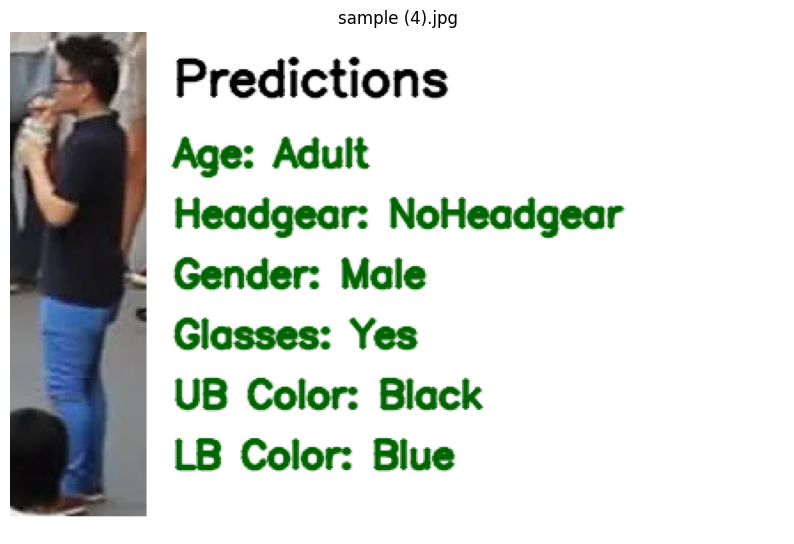

# Person Attribute Recognition (PAR)

This project implements a multi-task deep learning pipeline for Person Attribute Recognition (PAR), where a single model predicts multiple human attributes from cropped person images.

## 🚀 Attributes Predicted
- Age
- Headgear
- Gender
- Glasses
- Upper-body clothing color
- Lower-body clothing color

## 📌 Use Cases
- Surveillance systems
- Retail analytics
- Smart city monitoring
- Pedestrian analysis

## 📂 Dataset

The full dataset is too large to store directly in this repository.

You can download it here:
[Download dataset from Google Drive](https://drive.google.com/drive/folders/1O6qvqoTjxifEM6h8saifsdEuCj4fC695?usp=sharing)

After downloading, extract it and place it in the expected project directory before running the notebook.
## 📁 Expected Data Structure

data/
  images/
  final_labels.csv

## 🧠 Approach

Instead of training separate models for each attribute, this project uses a **multi-task learning approach**, where a shared pretrained backbone extracts common visual features and six task-specific classification heads predict different attributes simultaneously.

This improves:
- Efficiency (single model instead of many)
- Feature sharing across tasks
- Generalization performance

## ⚙️ Pipeline

1. Data loading and preprocessing  
2. Label encoding  
3. Train / Validation / Test split  
4. Multi-task model training  
5. Per-attribute evaluation using Accuracy, Macro Recall, and Macro F1  
6. Test prediction CSV generation  
7. External image inference and annotated prediction output  

## 📊 Results

Final test performance:

| Attribute | Accuracy | Macro Recall | Macro F1 |
|----------|----------|--------------|----------|
| Age | 0.9913 | 0.9175 | 0.9359 |
| Headgear | 0.9911 | 0.8630 | 0.8742 |
| Gender | 0.9607 | 0.9602 | 0.9601 |
| Glasses | 0.9017 | 0.8325 | 0.8314 |
| UBClothingColor | 0.8623 | 0.8258 | 0.8208 |
| LBClothingColor | 0.8703 | 0.7734 | 0.7581 |

**Overall test mean Macro F1: 0.8634**

## 📌 Key Findings

- **Age** and **Gender** were the strongest-performing attributes.
- The most challenging tasks were **Lower-body clothing color**, **Upper-body clothing color**, and **Glasses**, which are more fine-grained and sensitive to lighting, occlusion, and small visual regions.
- Although **Headgear** achieved very high accuracy, its lower Macro F1 suggests weaker performance on minority classes.
- Class imbalance likely affected results, especially for headgear, glasses, and clothing color classes.

## 🖼️ Example Output

Example external image inference with annotated predictions:

## 🛠️ Tech Stack
- Python
- PyTorch
- OpenCV
- Pandas
- NumPy
- Google Colab

## 📂 Dataset
This repository can be run using the provided notebook and sample data.  
If the full dataset is not included, add your dataset in the expected folder structure before training.

## 📈 Future Improvements
- Use transformer backbones such as ViT or Swin
- Handle class imbalance with class-weighted loss or focal loss
- Increase image resolution for small-object attributes such as glasses and headgear
- Explore task-balanced loss weighting
- Add region-aware or attention-based modeling for localized attributes

## 👨‍💻 Author
R Rajasekar
